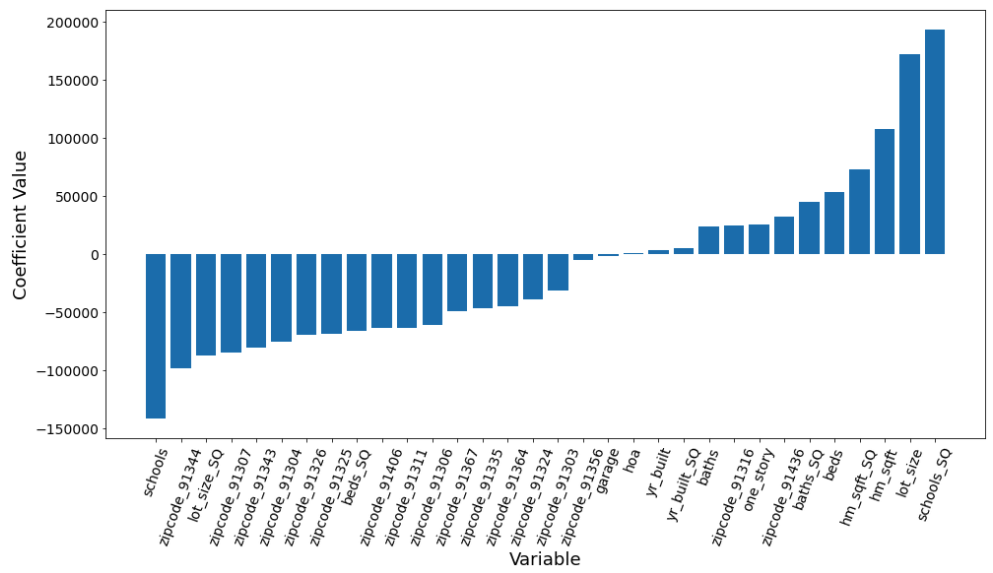
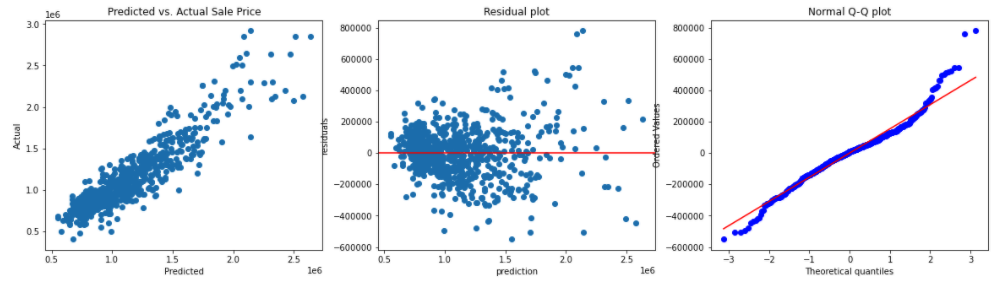

# Minimum Viable Product

#### Regression Model to Predict Sales Price of a Single Family Home in the West San Fernando Valley

The goal of this poject is to develop a regression model which can help realtors in the West San Fernando Valley accurately forecast the sales price of homes which they may soon be involved with (representing either the seller or the buyer). They hope such a model can give them and their clients a noticeable advantage in this historically competitive market.

Recent sales data for local single family homes over the past 90 days has been scraped, assembled and cleaned to provide training (and eventually testing) datasets for the models under development. Thus far, several different linear regression models have been developed, starting with an all-variables baseline OLS model, followed by a second OLS model with four second-order variables from the original feature set added as engineered features based on observed square law relationships with the target (as revealed in pair plots). 

From there, Lasso, Ridge and ElasticNet regression models were developed with the feature-engineered dataset. Thus far, ElasticNet appears to be the most promising based on 5-fold cross validation and observation of both R-squared and Mean Absolute Error (MAE). It is currently beleived that minimizing MAE (and its standard deviation), expressed in dollars, constitutes the most meaningful performance metric from the client perspective.

These are the best cross validation results observed so far (5-folds, using optimal parameters for ElasticNet regression):

|                       | Fold 1  | Fold 2 | Fold 3  | Fold 4  | Fold 5  |       Mean       |
| --------------------: | :-----: | :----: | :-----: | :-----: | :-----: | :--------------: |
|         CV R-Squared: |  0.850  | 0.833  |  0.820  |  0.769  |  0.744  | 0.803 +/- 0.040  |
| Adjusted CV R-Squared |  0.844  | 0.826  |  0.812  |  0.759  |  0.733  | 0.795 +/- 0.042  |
|           CV MAE ($): | 130,860 | 120901 | 117,842 | 107,545 | 122,969 | 120,023 +/- 7581 |

A plot like the one below will be presented in the final report (and slides) to indicate the relative magnitudes and signs of the model variables, providing some insight into how each contributes to a home sale price prediction:

Furthermore, diagnostic plots like these will be presented to demonstrate model quality (including adherence to linear model assumptions):

